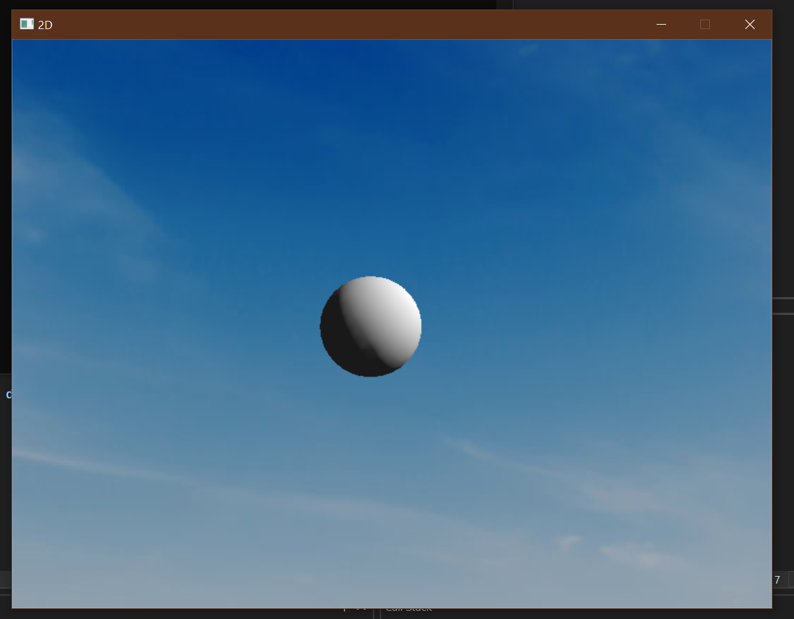
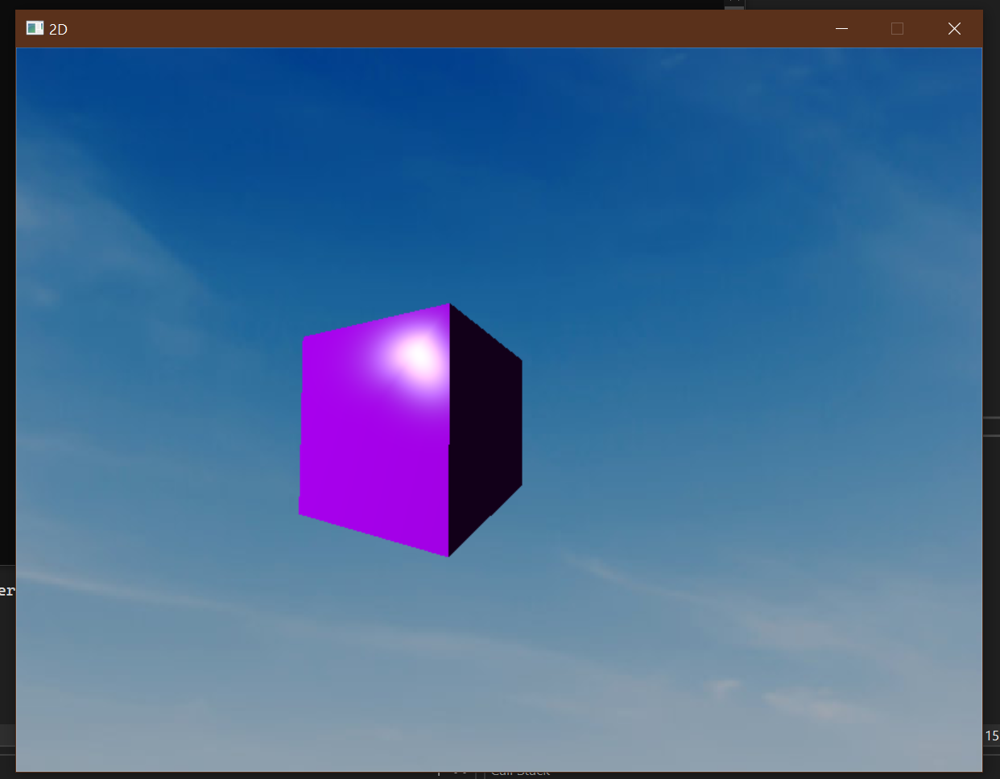
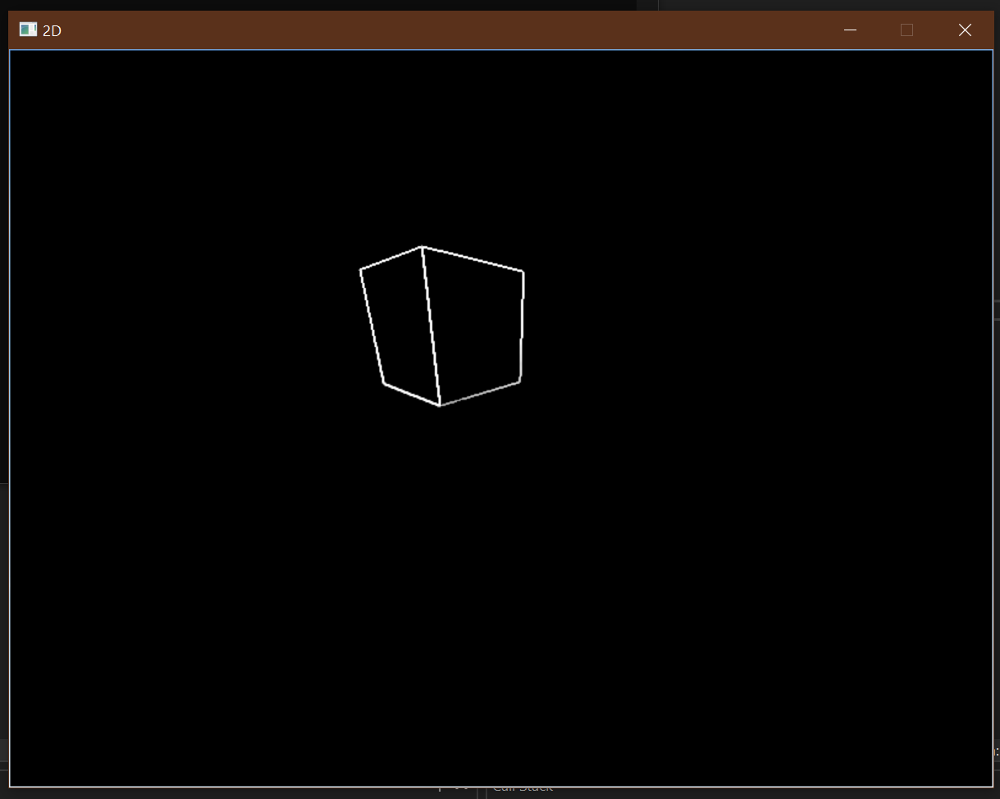
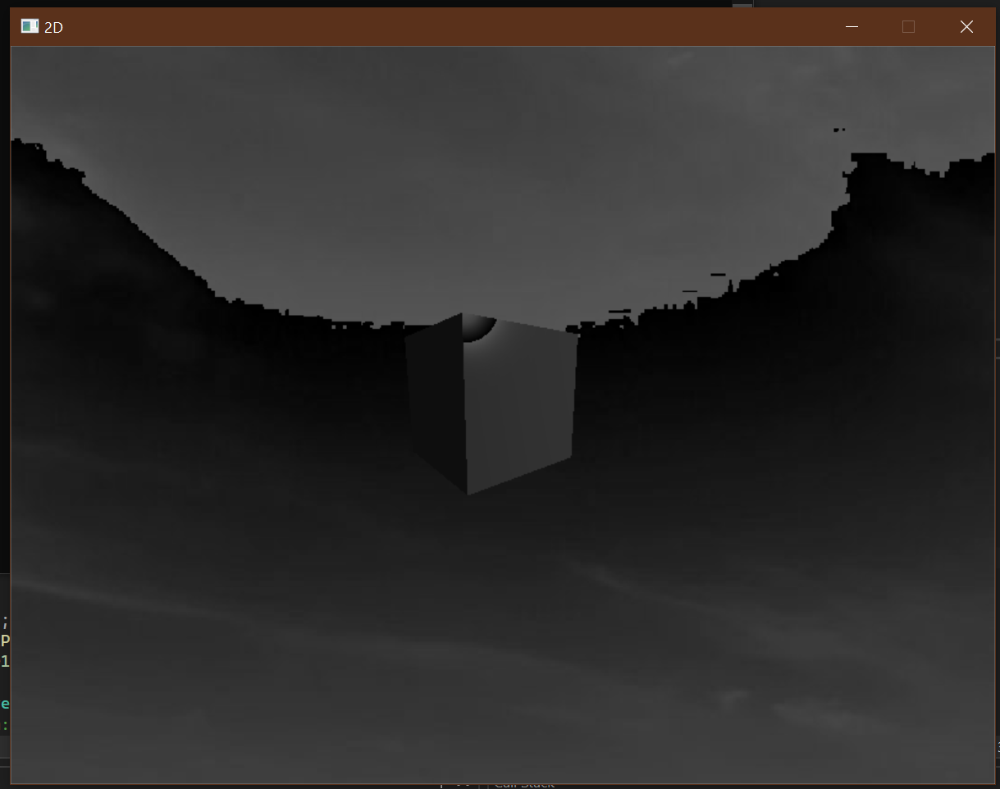
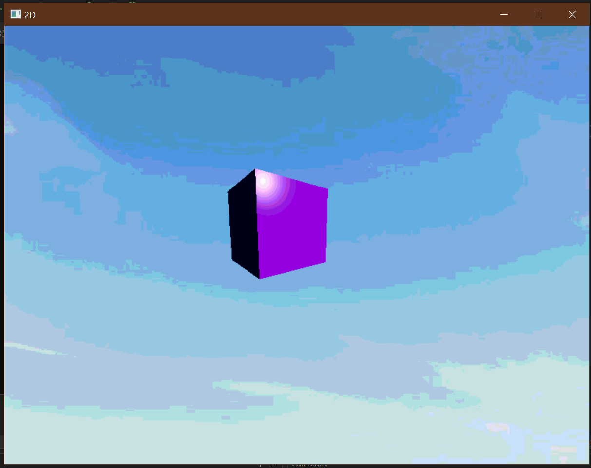
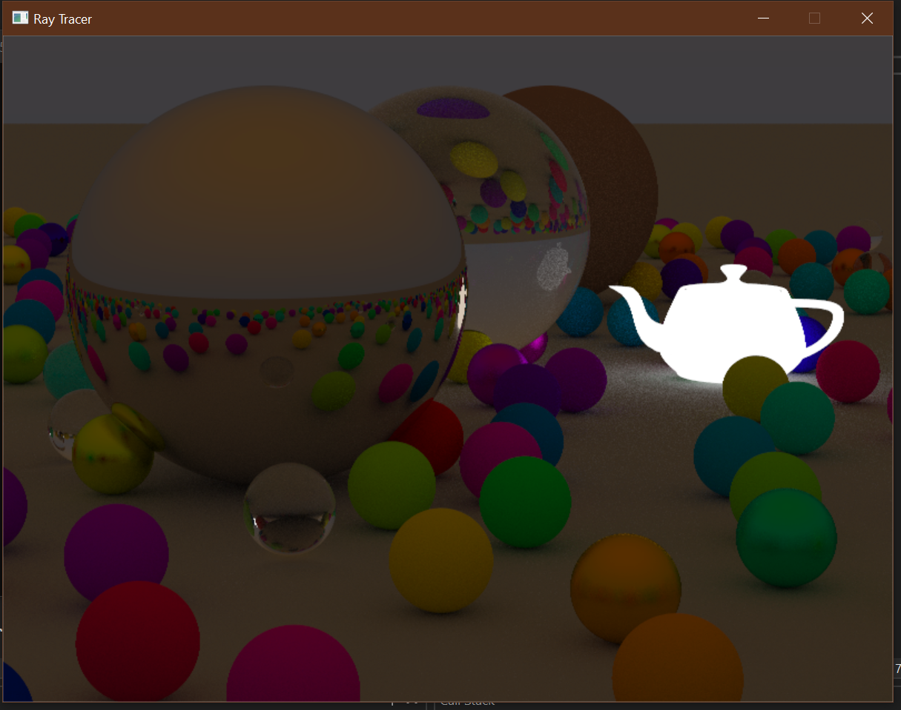

# C++ Renderer and Ray Tracer

This project is a C++ application built from scratch that combines two rendering systems: a **Software Renderer** and a **Ray Tracer**. Each system is designed to showcase advanced graphics techniques, utilizing the SDL and GLM libraries for efficient rendering and mathematical operations.

## Features

### Software Renderer
- **Shader Support**: Incorporates customizable shaders to manipulate rendering behavior.
- **Lighting Techniques**:
  - **Gouraud Shading**: Smooth interpolation of vertex lighting across surfaces.
  - **Phong Shading**: Realistic per-pixel lighting for dynamic highlights.

### Ray Tracer
- **Material Types**: Supports different material properties for enhanced realism.
- **Anti-Aliasing**: Reduces jagged edges for smoother visuals.

## Dependencies

The following libraries are required to build and run the project:
- **SDL2**: Simple DirectMedia Layer for window creation and rendering support.
- **GLM**: OpenGL Mathematics library for vector and matrix operations.

Ensure you have these dependencies installed before proceeding.

## Installation and Setup

### Clone the Repository:
```bash
git clone <repository_url>
cd <repository_directory>
```

## Install Dependencies

### SDL2
```bash
# For Linux
sudo apt-get install libsdl2-dev

# For macOS
brew install sdl2
```

### GLM
```bash
# For Linux
sudo apt-get install libglm-dev       

# For macOS
brew install glm
```

## Build the Project

Ensure you have a C++ compiler that supports **C++17** or higher. Run the following commands:

```bash
mkdir build && cd build
cmake ..
make
```

## Run the Application

```bash
./RendererRayTracer
```

## Usage

- The application offers a menu to switch between the **Software Renderer** and **Ray Tracer** modes.
- Lighting and material configurations can be adjusted via the provided settings interface.

## Screenshots







## Contributing

Contributions are welcome! If you have ideas to enhance this project, feel free to:

1. Fork the repository.
2. Create a feature branch.
3. Submit a pull request with detailed explanations.

## License

This project is licensed under the **MIT License**. See the `LICENSE` file for details.

## Acknowledgments

- **SDL** and **GLM** for their robust libraries.
- Graphics pioneers for inspiring lighting and rendering techniques.

Feel free to provide feedback or open issues to help improve the project!
